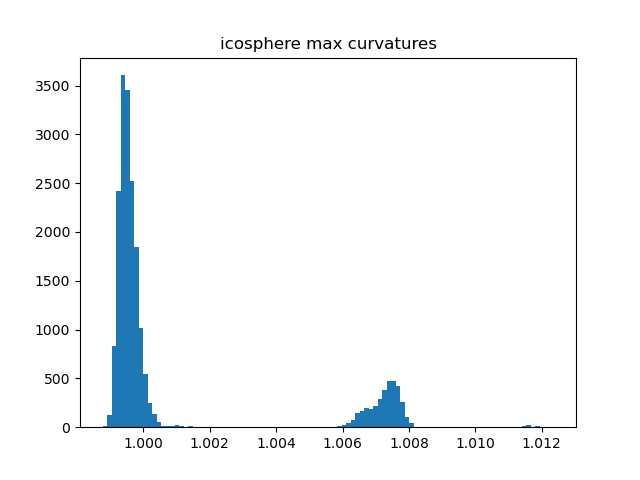
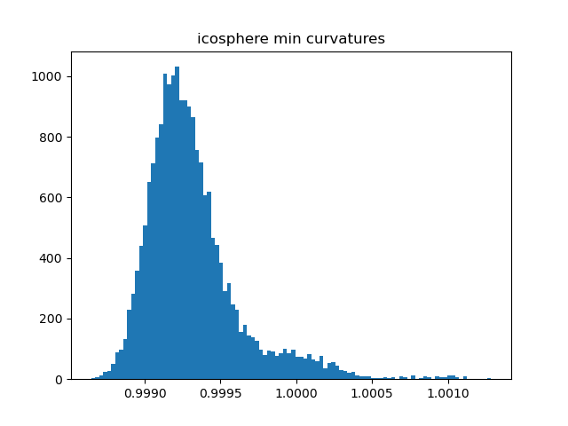

# 3DVC_HW1

陈新	2022210877	计研三一

## 1. QCQP

### 1

$\nabla_x L = A^T(A \bullet x - b) +2 \lambda x$

### 2

$x = (A^T A)^{-1} A^T b$

$\text{when} \space x^Tx < \epsilon$

### 3

$x = h(\lambda) = (A^T A + 2 \lambda I)^{-1} A^T b$

prof:
$$
\begin{aligned}

h(\lambda)^T h(\lambda) &= 
b^T A (A^T A + 2 \lambda I)^{-1T} (A^T A + 2 \lambda I)^{-1} A^T b \\

\frac{\partial h(\lambda)^T h(\lambda)}{\partial \lambda} &= 
-4 (A^T b)^T (A^T A + 2 \lambda I)^{-1} A^T b

\end{aligned}
$$
Because $A^T A = U \Lambda U^T$, where $U$ is positive-definite matrix and $\Lambda$ is all-positive diagonal matrix, so
$$
\begin{aligned}

\frac{\partial h(\lambda)^T h(\lambda)}{\partial \lambda}
&= -4 (A^T b)^T (U \Lambda U^T + 2 \lambda I)^{-1} (A^T b) \\
&= -4 (A^T b)^T (U(\Lambda  + 2 \lambda U^{-1} U^{T-1})U^T)^{-1} (A^T b) \\
&= -4 (U^{-1} A^T b)^T (\Lambda  + 2 \lambda (U^{T} U)^{-1})^{-1} (U^{-1} A^T b)

\end{aligned}
$$
Assume $y = U^{-1} A^T b$, then $\frac{\partial h(\lambda)^T h(\lambda)}{\partial \lambda} = -4 y^T (\Lambda  + 2 \lambda (U^{T} U)^{-1})^{-1} y$

Then $\Lambda  + 2 \lambda (U^{T} U)^{-1}$  and $(\Lambda  + 2 \lambda (U^{T} U)^{-1})^{-1}$ is positive-definite matrices when $\lambda \gt 0$.

So $\frac{\partial h(\lambda)^T h(\lambda)}{\partial \lambda} \le 0$ for $\lambda \gt 0$

$h(\lambda)^T h(\lambda)$ is monotonically decreasing for $\lambda \ge 0$

### 4

Use binary search, with $\lambda_r - \lambda_l <= 1e-6$ as termination condition, and we get 
$$
x = 
\begin{bmatrix}
  0.09795037 & -0.12841611 &  0.04953703 &  0.06482821 &  0.04341127 &  0.06206457	\\
 -0.16418657 &  0.03840062 &  0.30916183 & -0.12387916 &  0.06729935 & -0.0128481	\\
 -0.03535067 & -0.10851552 & -0.02132294 & -0.12418856 &  0.18965701 & -0.15722888	\\
 -0.17646316 &  0.04182668 &  0.09246272 &  0.11353752 & -0.1029304  & -0.03047963	\\
  0.03294807 & -0.23714281 & -0.14864612 & -0.07861543 &  0.15917447 & -0.22602599	\\
\end{bmatrix}
\\
f(x) = 8.610063646489696
$$

## 2. 3D Geometry Processing

### 1. Sample 100K points uniformly on the surface

### 2. Use iterative farthest point sampling method to sample 4K points from the 100K uniform samples

### 3. Normal estimation

Use PCA method to fit 50 neighbor points around the target point with `n_components=3`. The first 2 components represent the 2 directions with larger variance, namely the fitted plane. The 3rd component with the smallest variance represent the fitted normal. 

### 4.

#### sievert

    
    

    
    

#### icosphere

    
    

    
    

### 5. 

## 3. Rotation

### 1

$$
|(p+q)/2| = \sqrt{\frac{1}{2} + \frac{1}{8} + \frac{1}{8}} = \frac{\sqrt{3}}{2}	\\
   
   r = \sqrt{\frac{2}{3}} + \frac{i}{\sqrt{6}} + \frac{j}{\sqrt{6}}	\\
   
   R(r) = 
   \begin{bmatrix}
     \frac{2}{3} & \frac{1}{3} &  \frac{2}{3}	\\
     \frac{1}{3} & \frac{2}{3} &  -\frac{2}{3}	\\
     -\frac{2}{3} & \frac{2}{3} &  \frac{1}{3}	\\
   \end{bmatrix}	\\
   
   \theta_r = 2 \arccos(\sqrt{\frac{2}{3}}) \approx 70 \degree 	\\
   
   \hat{\omega}_r =
   \begin{bmatrix}
   \frac{1}{\sqrt{6}}	\\
   \frac{1}{\sqrt{6}}	\\
   0
   \end{bmatrix}
   
   / \sin(\frac{\theta}{2}) = 
   
   \begin{bmatrix}
   \frac{1}{\sqrt{2}}	\\
   \frac{1}{\sqrt{2}}	\\
   0
   \end{bmatrix}
$$

   

### 2. Exponential coordinate:

$p:$
$$
\theta_p = 2 \arccos(\frac{1}{\sqrt{2}}) = 90 \degree 	\\

\hat{\omega}_p =
\begin{bmatrix}
\frac{1}{\sqrt{2}}	\\
0	\\
0
\end{bmatrix}

/ \sin(\frac{\theta}{2}) = 

\begin{bmatrix}
1	\\
0	\\
0
\end{bmatrix}	\\

\vec{\omega}_p = \hat{\omega}_p \theta = 
\begin{bmatrix}
\frac{\pi}{2}	\\
0	\\
0
\end{bmatrix}	\\
$$
$q:$
$$
\theta_q = 2 \arccos(\frac{1}{\sqrt{2}}) = 90 \degree 	\\

\hat{\omega}_q =
\begin{bmatrix}
0	\\
\frac{1}{\sqrt{2}}	\\
0
\end{bmatrix}

/ \sin(\frac{\theta}{2}) = 

\begin{bmatrix}
0	\\
1	\\
0
\end{bmatrix}	\\

\vec{\omega}_q = \hat{\omega}_q \theta = 
\begin{bmatrix}
0	\\
\frac{\pi}{2}	\\
0
\end{bmatrix}	\\
$$

### 3

#### (a)

$$
[\omega_p] = 
\begin{bmatrix}
0 & 0 & 0 \\
0 & 0 & -1 \\
0 & 1 & 0 \\
\end{bmatrix},

R_p = 
\begin{bmatrix}
1 & 0 & 0 \\
0 & 0 & -1 \\
0 & 1 & 0 \\
\end{bmatrix}	\\

[\omega_q] = 
\begin{bmatrix}
0 & 0 & 1 \\
0 & 0 & 0 \\
-1 & 0 & 0 \\
\end{bmatrix},

R_q = 
\begin{bmatrix}
0 & 0 & 1 \\
0 & 1 & 0 \\
-1 & 0 & 0 \\
\end{bmatrix}	\\
$$

#### (b)

Assume $\omega_1 = \omega_p \theta, \omega_2 = \omega_q \theta, \theta = 90 \degree = \theta_p = \theta_q$
$$
\begin{aligned}

e^{([\omega_1] + [\omega_2])} 
&= I + ([\omega_p] + [\omega_q]) \sin{\theta} + ([\omega_p] + [\omega_q])^2 (1 - \cos{\theta})	\\
&= 
\begin{bmatrix}
0 & 1 & 1 \\
1 & 0 & -1 \\
-1 & 1 & -1 \\
\end{bmatrix}	\\

e^{[\omega_1]} e^{[\omega_2]} 
&= (I + [\omega_p] \sin{\theta} + [\omega_p]^2 (1 - \cos{\theta})) (I + [\omega_q] \sin{\theta} + [\omega_q]^2 (1 - \cos{\theta}))	\\
&= 
\begin{bmatrix}
0 & 0 & 1 \\
1 & 0 & 0 \\
0 & 1 & 0 \\
\end{bmatrix}	\\

\end{aligned}
$$
$e^{([\omega_1] + [\omega_2])} \neq e^{[\omega_1]} e^{[\omega_2]}$ in this case, so $e^{([\omega_1] + [\omega_2])} = e^{[\omega_1]} e^{[\omega_2]}$ doesn't hold for exponential map in general. 

#### (c)

##### (i)

1. Initiate $R = I$

2. $$
   \begin{aligned}
   
   R_2^T R_2 
   I &= (I + [\Delta \omega])^T R_1^T R_1 (I + [\Delta \omega])	\\
   I &= I + [\Delta \omega]^T + [\Delta \omega] + [\Delta \omega]^T [\Delta \omega]	\\
   0 &= [\Delta \omega]^T [\Delta \omega]	\\
   
   \end{aligned}
   $$

   $\text{namely} \space |\Delta \omega|^2 < \epsilon$
   $$
   \begin{aligned}
   
   |R_1(I + [\Delta \omega]) X - Y|^2_F 
   &= |R_1 [\Delta \omega] X - (Y - R_1 X)|^2_F	\\
   &\le |R_1|_F^2 \times |[\Delta \omega] X - (R_1^{-1}Y - X)|_F^2	\\
   &= 3 |[\Delta \omega] X - (R_1^{-1}Y - X)|_F^2
   
   \end{aligned}
   $$
   Assume $X = (x_1, x_2, ..., x_n)$, then
   $$
   \begin{aligned}
   \\
   
   [\Delta \omega] X
   &= ([\Delta \omega] x_1, ..., [\Delta \omega] x_n)	\\
   &= (-[x_1] \Delta \omega, ..., -[x_n] \Delta \omega)	\\
   &= -([x_1], ..., [x_n]) \Delta \omega	\\
   
   \end{aligned}
   $$
   Let $A' = ([x_1], ..., [x_n]), B' = X - R^{-1} Y$

   And the minimized function use F-norm, which has no relationship with the shape of $A$ and $B$. Thus we can reshape $A'$ to $A$ as $(n \times 3, 3)$, reshape $B'$ to $b$ as $(n \times 3, 1)$

   So the problem comes to
   $$
   \left\{
   
   \begin{aligned}
   
   &\text{minimize}_{\Delta \omega} & |A \Delta \omega - b|^2_2	\\
   &\text{subject to} & |\Delta \omega|^2 < \epsilon
   
   \end{aligned}
   
   \right.
   $$
   
3. Update R by $R = R e^{[\Delta \omega]}$

4. Go to step 2

##### (ii)

Set $\epsilon = 1e-2$, and $|R_2 - R_1|_F \le 1e-6$ as termination condition, we get
$$
\begin{aligned}

& R =
\begin{bmatrix}
-0.95173078 &  0.21671065 &  0.21735838	\\
-0.15383912 &  0.27598814 & -0.94876964	\\
-0.26559688 & -0.93641173 & -0.22932771	\\
\end{bmatrix}
\\

& |RX - Y|_F^2 = 120.23340717366894

\end{aligned}
$$

### 4

$p' = -p$
$$
\theta_{p'} = = 270 \degree,

\hat{\omega}_{p'} =
\begin{bmatrix}
-1	\\
0	\\
0
\end{bmatrix},

\vec{\omega}_{p'} = \hat{\omega}_{p'} \theta = 
\begin{bmatrix}
-\frac{3\pi}{2}	\\
0	\\
0
\end{bmatrix},

R_{p'} = 
\begin{bmatrix}
1 & 0 & 0 \\
0 & 0 & -1 \\
0 & 1 & 0 \\
\end{bmatrix} = R_p
$$
$q' = -q$
$$
\theta_{q'} = = 270 \degree, \space

\hat{\omega}_{q'} =
\begin{bmatrix}
0	\\
-1	\\
0
\end{bmatrix}, \space

\vec{\omega}_{q'} = \hat{\omega}_{q'} \theta = 
\begin{bmatrix}
0	\\
-\frac{3\pi}{2}	\\
0
\end{bmatrix},

R_{q'} = 
\begin{bmatrix}
0 & 0 & 1 \\
0 & 1 & 0 \\
-1 & 0 & 0 \\
\end{bmatrix} = R_q
$$
We can observe that $\theta' = 2\pi - \theta, \hat{\omega}' = -\hat{\omega}, \vec{\omega}' = \vec{\omega} - 2 \pi \hat{\omega}, M' = M$ for both $(p, -p), (q, -q)$

Namely quaternion $r$ and $-r$ bing the same rotation effects. 

$\theta' = 2\pi - \theta, \hat{\omega}' = -\hat{\omega}, \vec{\omega}' = \vec{\omega} - 2 \pi \hat{\omega}, M' = M$ hold for any quaternion pair $(r, -r)$

Prof: assume $r' = -r$
$$
\theta_{r'} = 2 \arccos(-r_0) = 2\pi - \theta_r 	\\

\hat{\omega}_{r'} =

\begin{bmatrix}
-r_1	\\
-r_2	\\
-r_3
\end{bmatrix}
/ \sin(\frac{\theta_{r'}}{2}) =

- \begin{bmatrix}
r_1	\\
r_2	\\
r_3
\end{bmatrix}
/ \sin(\pi - \frac{\theta_{r}}{2}) =

- \begin{bmatrix}
r_1	\\
r_2	\\
r_3
\end{bmatrix}
/ \sin(\frac{\theta_{r}}{2}) =

- \hat{\omega}_r	\\

\vec{\omega}_{r'} = \hat{\omega}_{r'} \theta = -\hat{\omega}_{r} (2\pi - \theta_r) = \vec{\omega}_r - 2 \pi \hat{\omega}_r
$$

### 5

It is improper to use L2-loss when regressing $SO(3)$ represented as quaternion. 

Because taking the statement from question 4 into consideration, in some cases 2 different quaternions may bing the same rotation effects, like $r$ and $-r$. So if we use L2-loss, there will be multiple points with the same L2-loss of 0. It's not sure which one we will get, probabily the unexpected one. 

If we regress a rotation matrix with L2-loss, we will not encounter this particular problem because the rotation matrix for the same rotation is unique. 
