# 3DVC_HW2

陈新	2022210877	计研三一

P.S. : 运行时注意，代码使用 pytorch 2.0 新 feature `set_default_device`

## 1. Volume Rendering

Rendering output files in `Problem1/images`

### 1. Ray sampling

    <figure>
        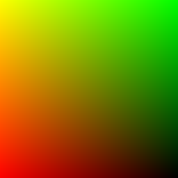
        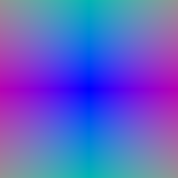
    </figure>

### 2. Point sampling

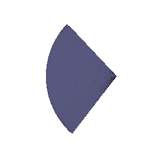

### 3. Theory of transmittance calculation

$$
\begin{aligned}

T(x_4, x_1) 
&= \prod_{i=1}^3 e^{-\sigma_i \Delta t_i}	\\
&= e^{- \sum_{i=1}^3 \sigma_i \Delta t_i}	\\
&= e^{-31}

\end{aligned}
$$

### 4. Rendering

    <figure>
        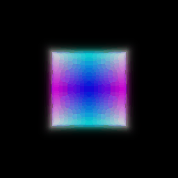
        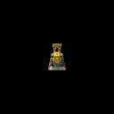
    </figure>

## 2. Single Image to 3D

### 1. Distance

Positive: $h(X, Y) \ge 0$

Prof:
$$
\begin{aligned}

\because \space & d(x_i, q_j) = || x_i - x_j ||_2 >= 0	\\
\therefore \space & d(X, Y) = \max_{x_i \in X} { [\min_{y_j \in Y} { [d(x_i, y_j)] }] } \ge 0	\\
& \text{Similarly} \space d(Y, X) \ge 0	\\
\therefore \space & h(X, Y) = \max { \{ d(X, Y), d(Y, X) \} } \ge 0

\end{aligned}
$$

Reflexive: $h(X, Y) = 0 \rightarrow X = Y$

Prof:
$$
\begin{aligned}

\because \space & h(X, Y) = \max { \{ d(X, Y), d(Y, X) \} } = 0	\\
\therefore \space & d(X, Y) = d(Y, X) = 0	\\
\because \space & d(X, Y) = \max_{x_i \in X} { [\min_{y_j \in Y} { [d(x_i, y_j)] }] } = 0	\\
\therefore \space & \forall x_i \in X, \min_{y_j \in Y} { [d(x_i, y_j)] } = 0	\\
\therefore \space & \forall x_i \in X, \exists y_j \in Y, s.t. x_i = x_j	\\
& \text{Similarly} \space \forall y_i \in Y, \exists x_j \in X, s.t. x_i = y_j	\\
\therefore \space & X = Y

\end{aligned}
$$

Triangular inequation: $h(A, C) \le h(A, B) + h(B, C)$

Prof:
$$
\begin{aligned}

h(A, B) + h(B, C)
&= \max { \{ d(A, B), d(B, A) \} } + \max { \{ d(B, C), d(C, B) \} }	\\
& \ge \max { \{ d(A, B) + d(B, C), d(C, B) + d(B, A) \} } \\
& \ge d(A, B) + d(B, C)	\\
&= \max_{a \in B} { [\min_{b \in B} { [d(a, b)] }] } + \max_{b \in B} { [\min_{c \in C} { [d(b, c)] }] }	\\
& \ge \max_{a \in B} { [\min_{b \in B} { [d(a, b)] }] } + \min_{b \in B} { [\min_{c \in C} { [d(b, c)] }] }	\\
&= \max_{a \in B} { [\min_{b \in B} { [ \min_{c \in C} { [d(a, b) + d(b, c)] }] }] }	\\
& \ge \max_{a \in B} { [\min_{b \in B} { [ \min_{c \in C} { [d(a, c)] }] }] }	\\
&= \max_{a \in B} { [ \min_{c \in C} { [d(a, c)] }] }	\\
&= h(A, C)	\\

\text{Namely} &\space h(A, B) + h(B, C) \ge h(A, C)

\end{aligned}
$$

Different with that in the slides, I implement Chamfer Distance (CD) as below
$$
CD(S_1, S_2) = \frac{1}{|S_1|} \sum_{x \in S_1} { \min_{y \in S_2} { ||x - y||^2_2 } } + \frac{1}{|S_2|} \sum_{y \in S_2} { \min_{x \in S_1} { ||y - x||^2_2 } }
$$
to make the loss better scaled and robust to different $S_1, S_2$ size. (Although the network predicts 1024 points, same as those in test/training set) 

### 2. Network design

The network structures are as below:

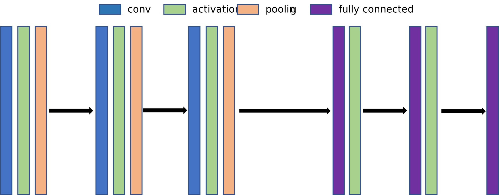

The former CNN part can extract features from the RBG image, and the latter MLP part predict point clouds. 

Note that I use `LeakyReLU` activation function in the CNN part, and `Tanh` in the MLP part. 

(I tried `two predictor branch version` in the paper, and it leads to unacceptable results with loss not decreasing during the training process. I don't know why. )

Use 80 cubes for training and 20 for evaluation, with all 16 views. 

Eval loss calculated every 50 epochs. Here are the visualized results (mean loss of a particular epoch): 

(Mean/Min/Max represent those of the final model's eval loss)

|                | Training Loss                                                | Eval Loss                                                    | Mean  | Min    | Max   |
| -------------- | ------------------------------------------------------------ | ------------------------------------------------------------ | ----- | ------ | ----- |
| clean, CD Loss |  |  | 0.108 | 0.0046 | 0.839 |
| noisy, CD Loss |  |  | 0.085 | 0.0111 | 0.675 |
| clean, HD Loss |  |  | 0.433 | 0.143  | 1.282 |
| noisy, HD Loss |  |  | 0.535 | 1.052  | 2.151 |

|                | Best Result                                           | Worst Result                                            |
| -------------- | ----------------------------------------------------- | ------------------------------------------------------- |
| clean, CD Loss | 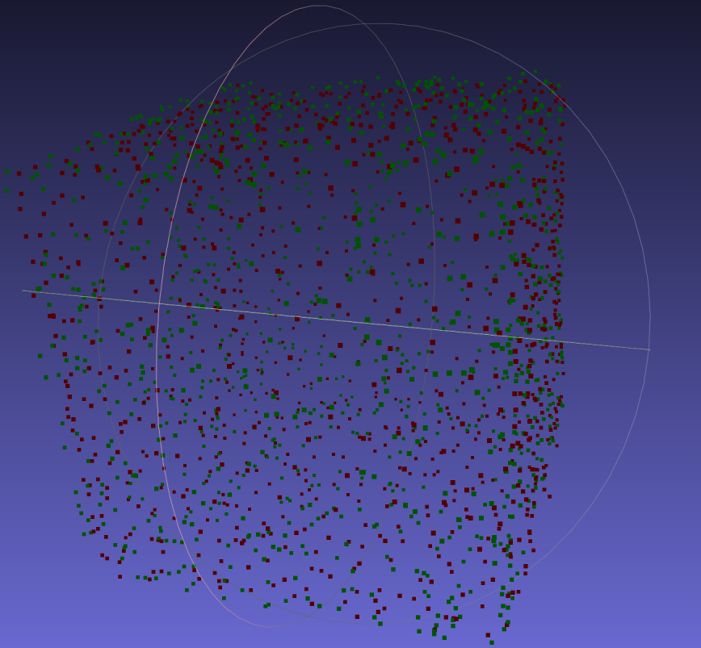 | 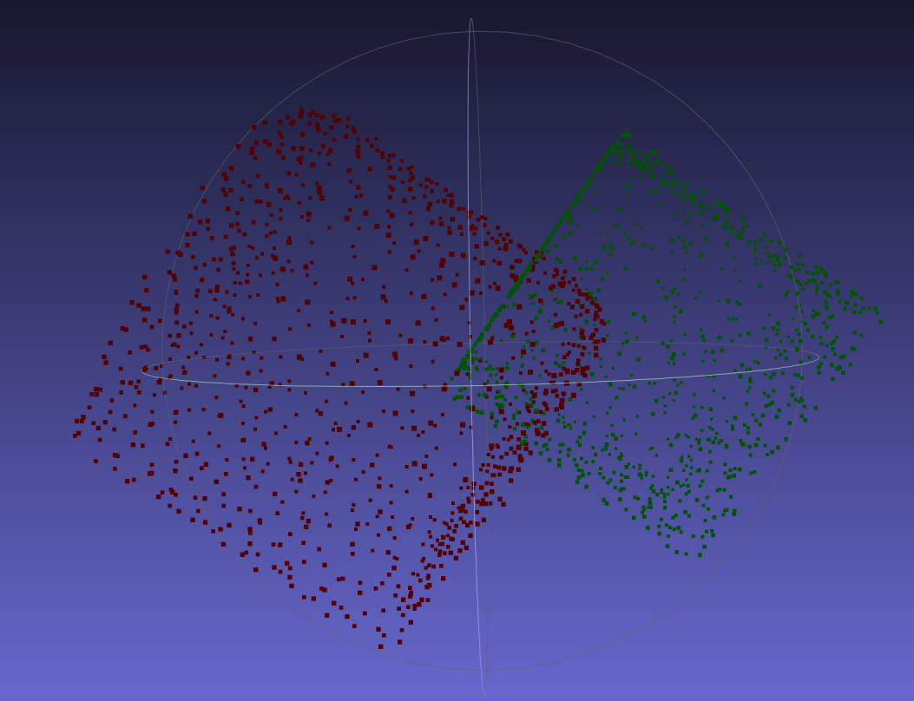 |
| noisy, CD Loss | 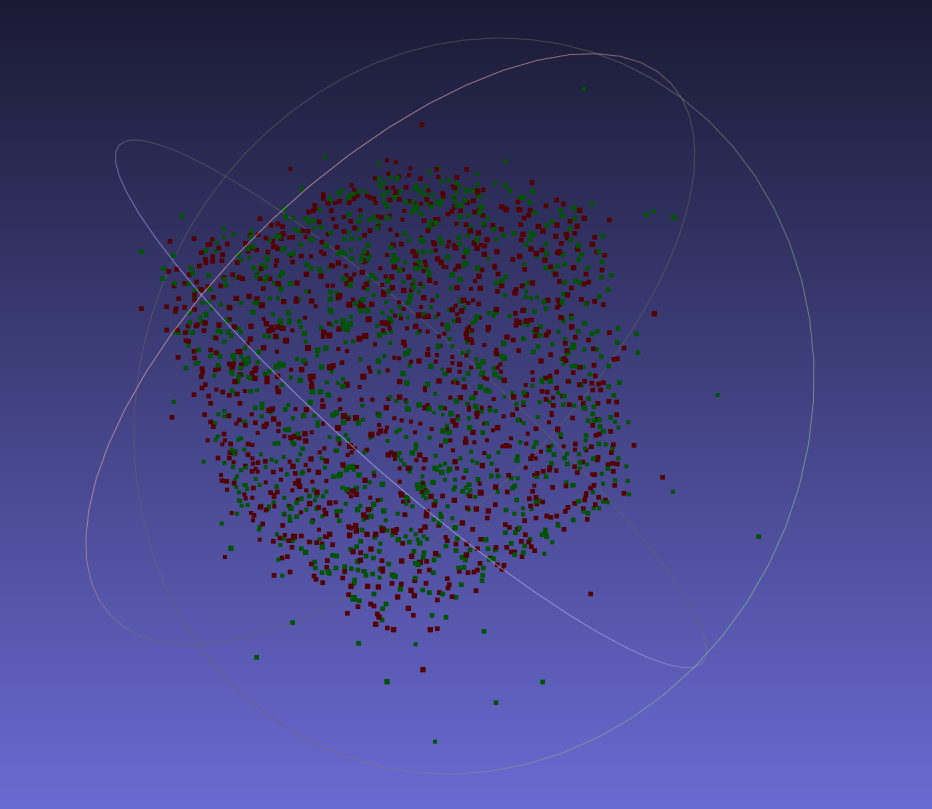 | 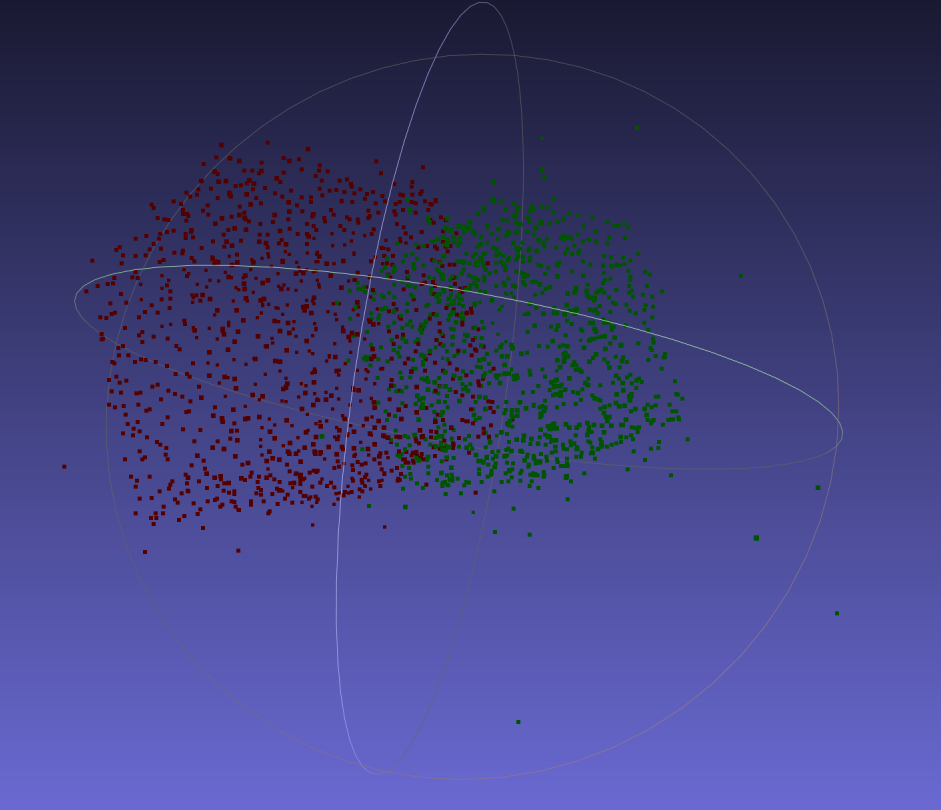 |
| clean, HD Loss | 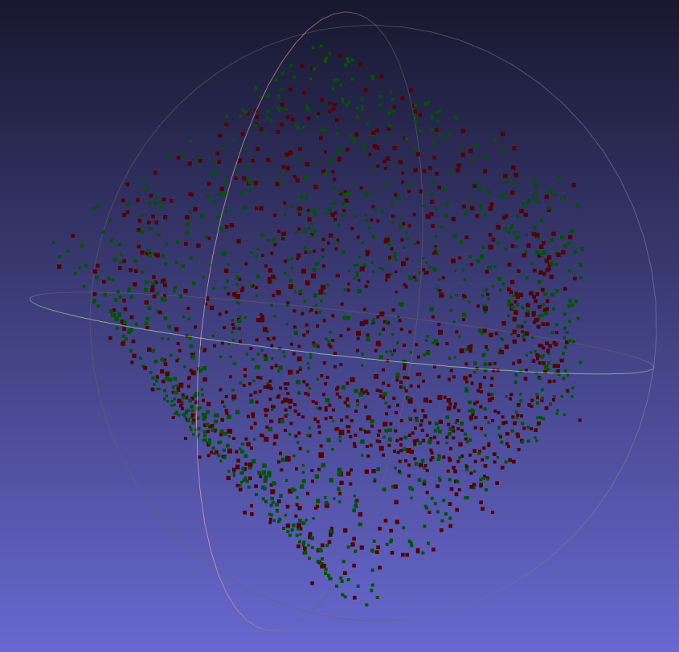 | 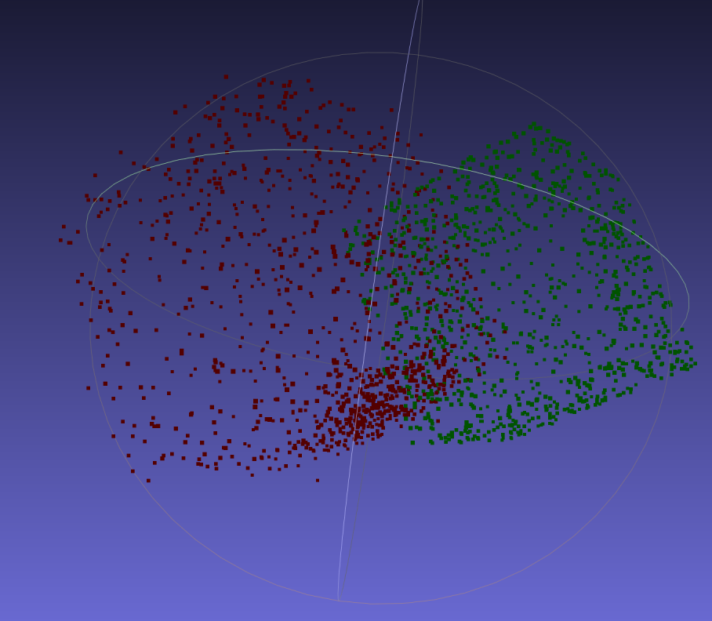 |
| noisy, HD Loss | 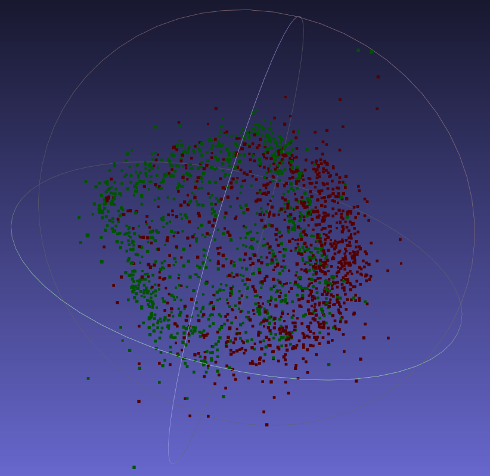 | 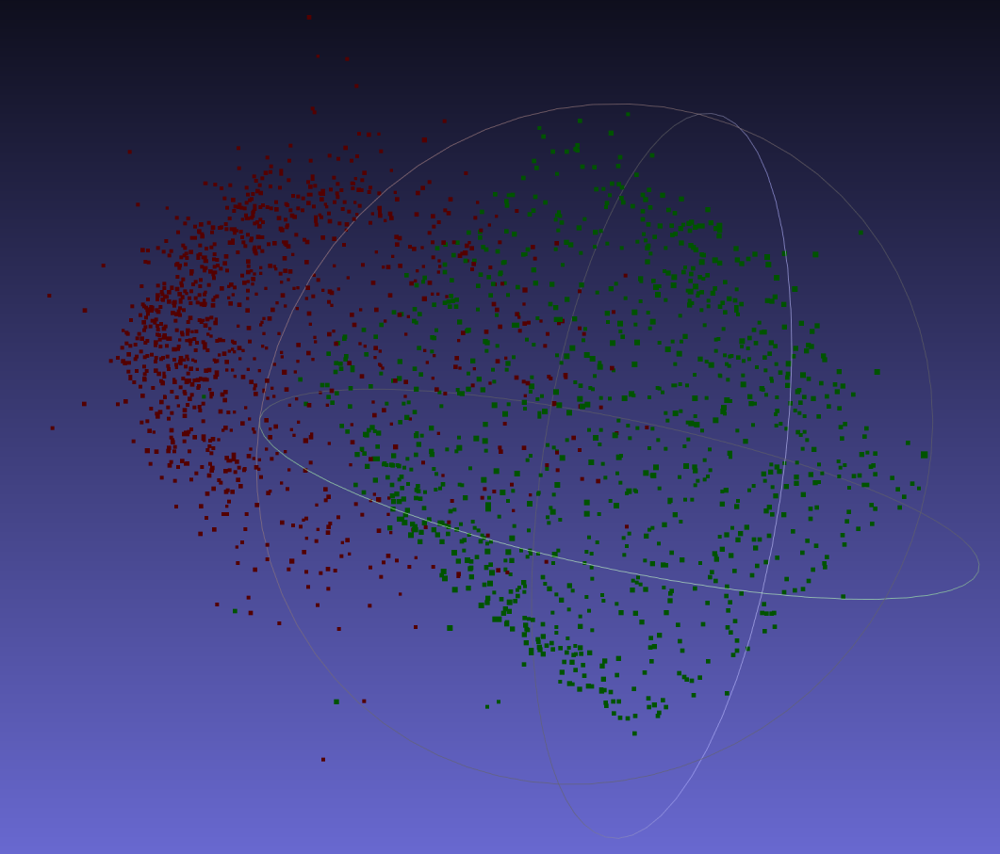 |

Noisy dataset are better than clean dataset, and as the network trains, eval loss increases generally. I think they are all because of overfitting. Small dataset size and clean data may result in overfitting, and the lack of regularizer adds to this problem. 

From my point of view, HD loss is less used in practice because it fully consists of $\max/\min$ function. As a result, let's say we are optimizing point clouds $S$ to $S_{target}$ directly with HD loss, when the loss backward, very few parameters of the predicted point clouds ordinates will have grad, which may largely slow down the optimizing speed.  With limited training time, we won't get a good result. 

## 3. Surface Reconstruction

### 1. MLS constraints

Set $\epsilon = 0.01$

The outer green points represent constraints (b), and the inner red points represent constraints (c)

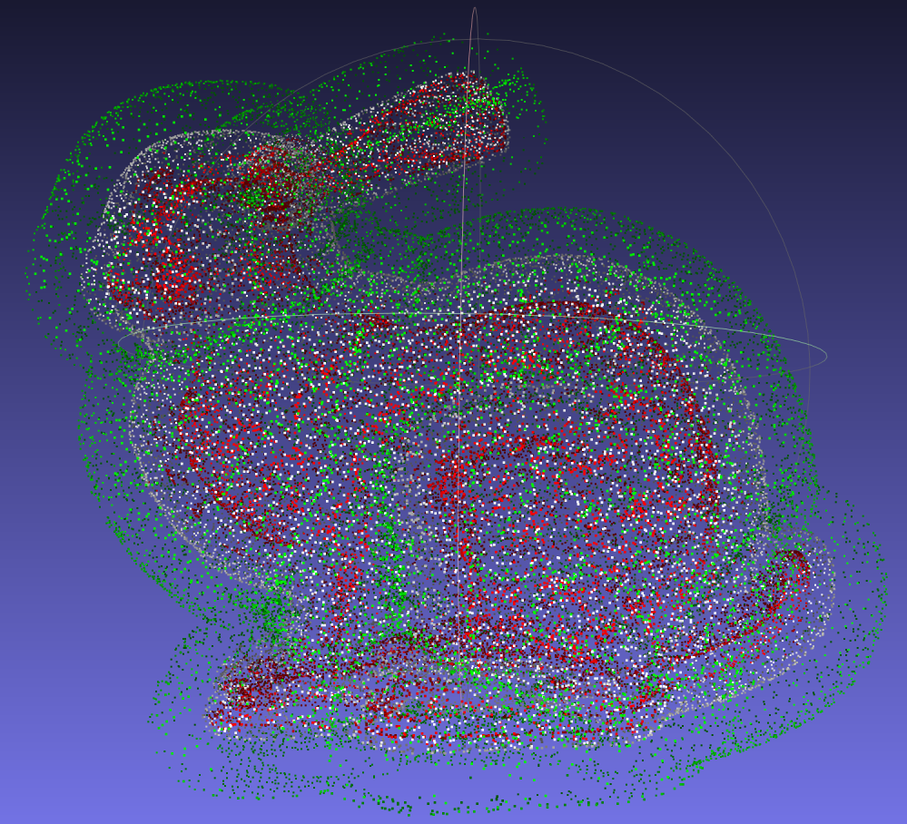

### 2. MLS interpolation

$$
\begin{aligned}

a_x
&= \arg \min_a \sum_{m=0}^{N-1} \theta(||x - c_m||) (b(c_m)^T a - d_m)^2	\\
&= \arg \min_a \sum_{m=0}^{N-1} (b(c_m)^T a \sqrt{\theta(||x - c_m||)} - d_m \sqrt{\theta(||x - c_m||)})^2	\\

\end{aligned}
$$

So we can transform $a_x$ to LS problem. 

For each dimension, I set 

​	Voxel number =  $(38, 37, 30)$

​	Voxel size = $(0.00461889, 0.00466862, 0.0046734)$

to capture the AABB. 

I used 3 weight functions:
$$
\begin{aligned}

\theta_{Gaussian}(r) &= e^{- \frac{r^2}{2h^2}}	\\
\theta_{Wendland}(r) &= (1 - \frac{r}{h})^4 (\frac{4r}{h} + 1)	\\
\theta_{Singular}(r) &= \frac{1}{r^2 + h^2}

\end{aligned}
$$
and $h \in (0.1, 0.01, 0.001)$, $N_{neighbors} \in (50, 200, 500, 1000)$

Outputs visualized in the next section. 

### 3. Marching Cube

As is stated in the last section, outputs of all the combination (adding $k \in (0, 1, 2)$) are listed in directories `./outputs-guassian_fn`, `./outputs-wendland_fn`, `./outputs-singular_fn`

Compared with $k, h, N_{neighbors}$, the selection of $\theta$ function seems to have smaller impact on the output, so we take $\theta_{Gaussian}$ as an example. 

Here are some selected results visualized in MeshLab: 

| k    | h    | n_neighbors | result                                                       |
| ---- | ---- | :---------- | ------------------------------------------------------------ |
| 0    | 0.1  | 200         | 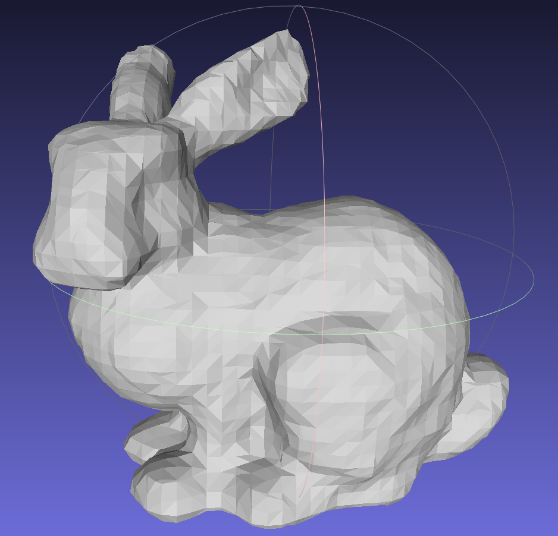 |
| 0    | 0.01 | 1000        | 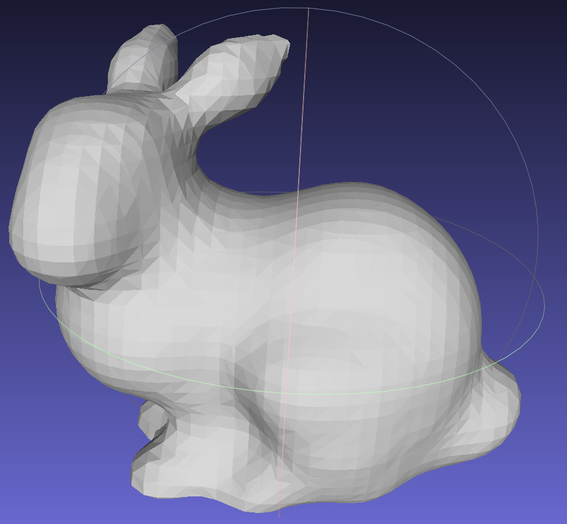 |
| 1    | 0.1  | 200         | 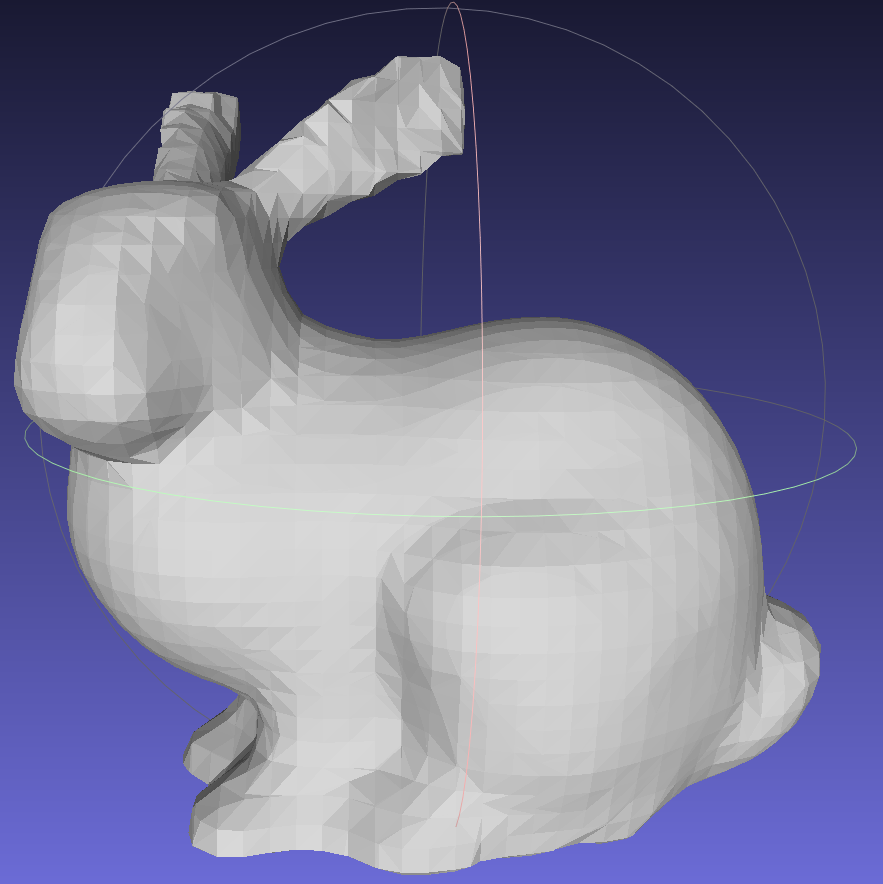 |
| 2    | 0.1  | 200         | 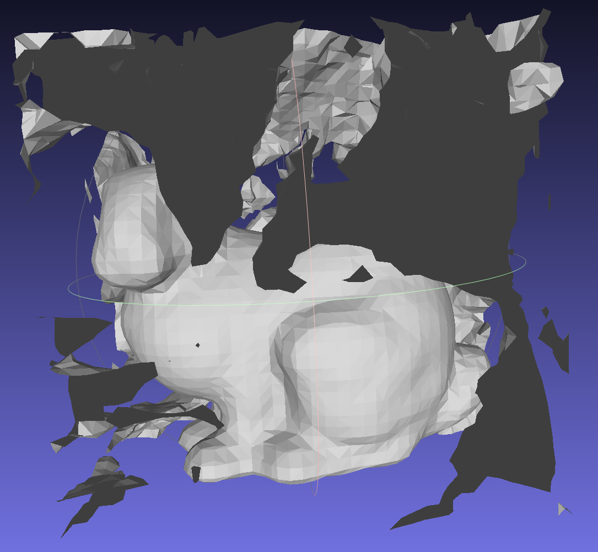 |

Overall, results of $h = 0.001$ are unacceptable. The best $N_{neighbors}$ is 200 or 500, otherwise the surface would be too smooth or too sharp. 

Although $k = 1$ is much smoother, it will eliminate high-frequency details, like dents in the eyes and neck. And the problem of surface sharpness could be easily solved by normal interpolation in rendering pipelines. So $k = 0$ is generally better than $k = 1$. 

$k=2$ is much worse, because it brings floating voxels at the corners/edges. I suppose it is because the MLS algorithm use LS to calculate argmin, which doesn't guarantee $f(c_i) = f_i$. When the polynomial order $k$ increases, the edge value of the function will become uncontrollable.  
