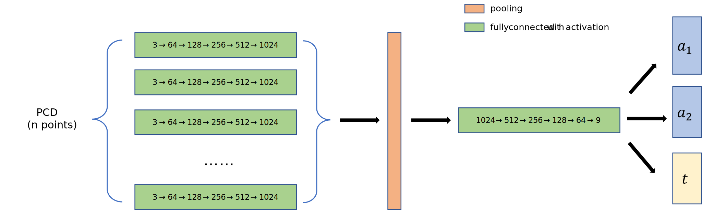

# 3DVC_Project

陈新	2022210877	计研三一

P.S. : The code works with pytorch 2.0 new feature `set_default_device`

Choose to solve `6D Object Pose Estimation`

Experiments carried on 

> Windows11
>
> i9-9900
>
> Mem 32G-3200MHz
>
> RTX-2080Ti

## 0. Background

We are given the RGB/depth/label images of a certain rendering setting, to estimate the transformation matrix of the object model to the scene's world space. 

We can easily get the PCD of the visiable part of the model in the world space of the scene. 

Thus, if we don't consider the RGB image, the problem is simplified to the estimation of the transformation from point set $p$ to $q$. 
$$
R, t = \text{argmax}_{R, t} ||Rp + t - q||
$$

## 1. ICP

### Method

Before ICP, we give a translation to the PCD so that the centers of gravity of two PCDs overlap. 

For a particular match `(src -> gt)` , we have a initial setting `(R_init, t_init)`

So we set $src = R_{init} @ src + t_{init}$ as the initial state to get a better result. 

For every iteration:

1. Calculate $x = R @ src + t$

2. Use K-d tree to query the nearest matching points. $y = src[match[x]]$

3. Calculate 
   $$
   H = (y - \bar{y}) @ (x - \bar{x})^T	\\
   $$
   Use SVD to solve
   $$
   H = U \Sigma V^T
   $$
   And we get
   $$
   R = U @ V^T	\\
   (\text{if } det(R) < 0, \text{flip the last row of } V^T)	\\
   t = \bar{y} - R @ \bar{x}
   $$

4. Iterate util `0 < loss - loss_new < tolerance` or `loss_new < tolerance` . Note that we set `tolerance = 1e-8` here. Since we have a distance match, we use a simple $L_2$ loss here. 

#### Initial pose

And I notice that the quality of ICP highly relies on the initial state `(R_init, t_init)`, so we first set $n\_seg ^ 3$ initial  poses to cover more poses. 

For example, when $n\_seg = 3$, we set Eurler angle $i, j, k$ as $0\degree, 120\degree, 240\degree$ separately, and combine them together to get 27 initial poses. 

##### Branch-cut

This brute-force method may cost too much time, which leads me to think how to cut branches. 

###### By geometric symmetry

Since we have geometric symmetry, so we can transform the object model in the object space to make use of it (we cannot transform the partial model in the image because the geometric symmetry is axis aligned with no rotation). 

If an axis's (let's say, `x`) geometric symmetry is

1.  `inf`, we set `n_seg_x = 1`
2. not mentioned, we set `n_seg_x = n_seg`
3. `k`, we set `n_seg_x =`
   1. $\min(2, n\_seg), \text{if } k = 3, 4$
   2. $1, \text{if } k \ge 5$

$\text{degree\_max } = n\_seg / k$

Additionally, if 2 axises have `inf` geometric symmetry, it means this object has `inf` geometric symmetry in the 3rd axis also. 

We can share k-d trees for query when the matching targets are the same, but the initialization algorithm will transform the target to different poses. So we add a simple optimization: if the object doesn't have geometric symmetry in any axis, we share the same kd tree of visiable points in world coordinate and rotate the model groud truth, otherwise we rotate the model object and construct a kd tree for each initial pose. 

###### By value

Since we have multiple initial poses, we will get several results. 

If `loss_min / obj_model.oblique_axis < loss_tolerance`, we can assume that we've found the correct answer. 

Here `obj_model.oblique_axis` represents the length of the oblique axis of the model's AABB. `loss_tolerance = 0.00011` according to our tests. 

In this way, we cut many unnecessary branches. 

### Experiments

We sample `n_sample_points = 10000` points on the object model surface (same for learning-based method)

`icp_tolerance = 1e-9`

`icp_max_iter = 500`

`loss_tolerance = 0.00011`

`n_seg = 3`

Success if rotation error < 5 degree and translation error < 1 cm. 

We roughly get a correct rate of 

1. $98.8\%$        `w/`     multi-initial pose  (and `w/` branch-cut, average $5.78$ of $3^3 = 27$ initial poses will be calculated)
2. $88.9\%$        `w/o`   multi-initial pose

on the training/validate dataset. 

Here are some examples:

    <figure>
        
        
    </figure>

Here are some failure cases:

    <figure>
        
        
        
    </figure>

The 1st failure case is caused by the number of the visiable points in the raw data. There are only tens of points so that the algorithm doesn't work. 

The 2nd failure case is caused by the geometric symmetry. The iterative algorithm falls into local minimum. 

The 3rd failure case is caused by our initialization method. We give it a translation before ICP so that we can make the gravity center of the 2 PCDs overlap, which makes the algorithm falls into local minimum. 

### Possible improvements

We set multiple initial poses to compensate for the initial pose sensitivity of the ICP. Although we also cut branches, the cost of ICP itself is very high, which makes that of the whole pipeline very high too. 

To avoid it, we can adopt some initialization algorithms like GO-ICP/... 

## 2. Learning-based method

### Method

#### 1. Representation

We use a 6D representation as below, to make it continuous and unique for a rotation. 

6D representation: $[a_1^T, a_2^T]$, where $a_1, a_2 \in R^{3\times1}$

Convert $x = [a_1^T, a_2^T]$ to a rotation matrix $R = [b_1, b_2, b_3]$ through the Gram-Schmidt process, where $b_1, b_2, b_3 \in R^{3\times1}$ with unit length,
$$
\begin{aligned}
b_1 &= \frac{a_1}{||a_1||}	\\
b_2 &= \frac{a_2 - <a_2, a_1> b_1}{||a_2 - <a_2, a_1> b_1||}	\\
b_3 &= b_1 \times b_2
\end{aligned}
$$
Convert a rotation matrix to 6D: $x = [b_1^T, b_2^T]$

#### 2. Loss

Chamfer Distance Loss(CD loss) are as below:
$$
L_{CD}(S_1, S_2) = \frac{1}{|S_1|} \sum_{x \in S_1} { \min_{y \in S_2} { ||x - y||^2_2 } } + \frac{1}{|S_2|} \sum_{y \in S_2} { \min_{x \in S_1} { ||y - x||^2_2 } }
$$
Since we only have a small part of the object point cloud, so we use a half-CD loss here:
$$
L_{CD\_half}(S_1, S_2) = \frac{1}{|S_1|} \sum_{x \in S_1} { \min_{y \in S_2} { ||x - y||^2_2 } }
$$
$S_1$ represents the partial PCD in the picture's world space, and $S_2$ represents the transformed whole object model PCD. 

In this way, if we get a perfect match, the loss may come close to 0, otherwise it may get values far bigger than 0. 

#### 3. Network design

We didn't use RGB information. Only geometric information is used. And we train 79 networks for 79 objects, which may improve the expressive ability of the network. 

The network structures are as below:

1. Concat the pre-transformed `world_coord` and `model_coord` as input, to improve the network's ability of expression. 
2. Use an MLP to get the features of each point. (1024-dimension features)
3. Use a max pooling layer to extract the feature of the whole PCD. 
3. Use an MLP to get a 9D feature (6D pose representation $[a_1^T, a_2^T]$ and a 3D translate $t$)

Considering that neural networks are more expressive when the values are in the range of $[-1, 1]$, we give a translate ($t_0$) to both the object model and visiable world coordinate PCD, so that no matter how the object model rotate, it will be in the range of  $[-1, 1]$. Adding the gravity center concerned translate $t_{mean}$ and the scene specified scale $S_0$, we get
$$
\begin{aligned}
s_0 (W + t_0) - t_{mean} &= s_0 R (M + t_0) + t	\\
W + t_0 - \frac{1}{s_0} t_{mean} &= RM + R t_0 + \frac{1}{s_0} t	\\
W &= RM + R t_0 -t_0 + \frac{1}{s_0} (t + t_{mean})	\\
\\
\text{Namely, } R' &= R, t' = R t_0 -t_0 + \frac{1}{s_0} (t + t_{mean})
\end{aligned}
$$

Then we use $L_{CD\_half}$ states above to calculate loss and backward. 

### Experiment

Use `Adam` optimizer and `LambdaLR` (`lr_lambda = lr_scheduler_gamma  ** (epoch / lr_scheduler_step_size )`)

`lr = 1e-4`

`lr_scheduler_step_size = 5`

`lr_scheduler_gamma = 0.9`

We separate training/validate set as the provided `splits`

Training for `10 epochs` because of time limit. 

We get a correct rate of $27.4\%$ on the validate set. 

Here are some examples:

    <figure>
        
    </figure>

Here are some failure cases:

    <figure>
        
        
        
        
        
    </figure>

Most of the failure cases are caused by local minimum. 

### Possible improvements

1. We refered to `PointNet` and designed a similar network to extract features of the PCD. However, the structure of this network (only 1 max pooling layer in the points channel) limits the ability of feature extraction. So this network structure can only extract global features and is more suitable for tasks based on global features like classification. 
   1. A possible solution is to extract features by LOD like `PointNet++`. For every extraction, we enlarge the kernel size to extract features from adjacent points, and add and MLP between 2 levels.  
   2. If there is more time for this project, I may try PCD registration like `PCRNet` or `OMNet`. We believe these networks are more suitable for this problem. 
2. We considered geometric symmetry in the ICP algorithm, but didn't consider it in the learning-based section, because of which the network will miss many correct answers. If we improve loss function by geometric symmetry, like a minimum of all possible transformation, the network will detect more potential correct answers I think. 
2. We didn't use RGB information, which could be used for pixel-PCD matching. A `ResNet` for RGB feature extraction may provide some help. 

## 3. Combination method

ICP algorithm is extremely accurate if we give it a good initial pose $(R_0, t_0)$ and it doesn't fall into local minimum. 

But as is stated above in the ICP section, we set multiple initial poses, each (expect those skipped by branch-cut algorithm) may go through ICP algorithm, which is very expensive. 

### Idea 1

We could use multiple initial poses and ICP to generate rough transformations $(R_0, t_0)$. 

For example, adjusting `icp_tolerance` from `1e-8` to `1e-2`. 

Apply the rough transform $(R_0, t_0)$ to the object model as input of the neural network (to solve the problems of initial poses sensitivity). 

We can also apply the possible improvements mentioned in both sections above.

### Idea 2

We could first use a neural network to learn the pose estimation in the case of orientation range $[-180\degree, 180\degree]$

Then, based on the transformation $(R_0, t_0)$ predicted by the network, the 2 PCDs can be further aligned precisely in the second stage by using ICP algorithm. 

### Experiments

We can record the speed and accuracy of experiment settings below:

Idea 1 and 2 can form a comparation themselves, to balance the speed and accuracy. 

We can also do some ablation studies on the 2 ideas:

1. Idea 1:
   1. Change the rough transformation generation algorithm, like different `icp_tolerance`, or no initialization
   2. Compare it with purely network method
   3. Compare it with idea 2
2. Idea 2:
   1. Compare the initial poses quality generated with clear/noisy input by network
   2. Compare it with purely ICP
   3. Compare it with idea 1
